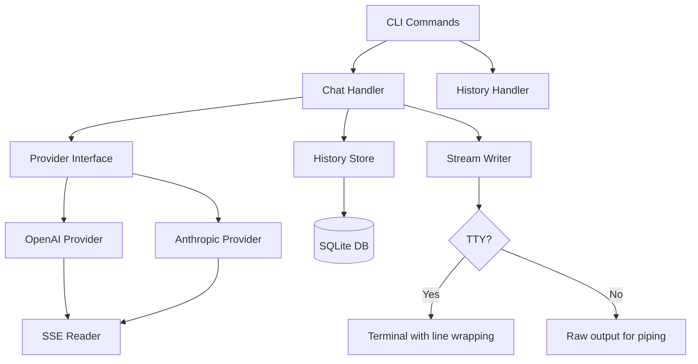

# ask

A multi-provider LLM CLI for conversational AI from the terminal.

[](https://github.com/devaloi/ask/actions/workflows/ci.yml)
[](https://go.dev)
[](LICENSE)

Stream responses from OpenAI or Anthropic directly in your terminal. Pipe in code for review, start interactive sessions, and browse your conversation history.

## Quick Start

```bash
# Install
go install github.com/devaloi/ask@latest

# One-shot question
ask "What is a goroutine?"

# Pipe code for review
cat main.go | ask "Review this code"

# Interactive mode
ask
```

## Prerequisites

- Go 1.22+ (uses `database/sql` improvements)
- OpenAI API key and/or Anthropic API key
- CGO enabled (required for SQLite)

## Installation

### From source

```bash
git clone https://github.com/devaloi/ask.git
cd ask
make build
# binary is at ./bin/ask
```

### With go install

```bash
go install github.com/devaloi/ask@latest
```

## Configuration

Set your API keys as environment variables:

```bash
export OPENAI_API_KEY="sk-..."
export ANTHROPIC_API_KEY="sk-ant-..."
```

Or create `~/.config/ask/config.yaml`:

```yaml
# Default provider (openai or anthropic)
provider: openai

# Default model for each provider
model: gpt-4o

# OpenAI settings
openai:
  api_key: ${OPENAI_API_KEY}  # references env var
  model: gpt-4o

# Anthropic settings
anthropic:
  api_key: ${ANTHROPIC_API_KEY}
  model: claude-sonnet-4-20250514
```

Configuration precedence (highest to lowest):
1. Command-line flags (`-p`, `-m`)
2. Environment variables (`OPENAI_API_KEY`)
3. Config file (`~/.config/ask/config.yaml`)
4. Built-in defaults

## Usage

### One-shot Chat

```bash
# Simple question
ask "Explain closures in Go"

# Specify provider and model
ask -p anthropic -m claude-sonnet-4-20250514 "Explain this concept"

# With system prompt
ask -s "You are a Go expert. Be concise." "What's the difference between make and new?"

# System prompt from file
ask -s @prompts/code-reviewer.txt "Review this function"

# Pipe input (code review, summarization)
cat main.go | ask "Find any bugs in this code"
git diff | ask "Summarize these changes"
echo "SELECT * FROM users" | ask "Is this SQL safe?"
```

### Interactive Mode

Start an interactive conversation:

```bash
ask
```

```
> What is a closure?
A closure is a function that captures variables from its enclosing scope...

> Give me a Go example
Here's a simple closure example in Go:
...

> /quit
```

**Commands in interactive mode:**
- `/quit` or `/exit` — End the session
- `/clear` — Clear conversation history
- Ctrl+D — Exit (same as /quit)
- Ctrl+C — Cancel current response

### Continue Previous Conversation

```bash
# Continue conversation #5
ask --continue 5 "One more question about that"

# Or start interactive mode continuing from #5
ask --continue 5
```

### History

```bash
# List recent conversations
ask history

# Search conversations
ask history --search "goroutine"

# Limit results
ask history --limit 5

# Show specific conversation
ask show 5
```

## Providers

### OpenAI

Requires `OPENAI_API_KEY` environment variable.

**Supported models:**
- `gpt-4o` (default)
- `gpt-4o-mini`
- `gpt-4-turbo`
- `gpt-3.5-turbo`

```bash
ask -p openai -m gpt-4o "Hello"
```

### Anthropic

Requires `ANTHROPIC_API_KEY` environment variable.

**Supported models:**
- `claude-sonnet-4-20250514` (default)
- `claude-3-5-sonnet-20241022`
- `claude-3-opus-20240229`
- `claude-3-haiku-20240307`

```bash
ask -p anthropic -m claude-sonnet-4-20250514 "Hello"
```

### Available Models

```bash
ask models
```

## History Storage

Conversations are stored in SQLite at:
- macOS: `~/Library/Application Support/ask/history.db`
- Linux: `~/.local/share/ask/history.db`

Each conversation includes:
- All messages (user, assistant, system)
- Provider and model used
- Timestamps
- Token usage (when available)

## Architecture



## Development

```bash
# Build
make build

# Run tests
make test

# Run with race detector
make test-race

# Lint
make lint

# Clean build artifacts
make clean
```

### Project Structure

```
ask/
├── cmd/              # CLI commands (cobra)
│   ├── root.go       # Root command, global flags
│   ├── chat.go       # Chat command (one-shot & interactive)
│   ├── history.go    # History listing
│   ├── show.go       # Show conversation
│   └── models.go     # List available models
├── internal/
│   ├── config/       # Configuration loading
│   ├── provider/     # LLM provider implementations
│   │   ├── provider.go   # Interface and factory
│   │   ├── openai.go     # OpenAI streaming
│   │   └── anthropic.go  # Anthropic streaming
│   ├── history/      # SQLite conversation storage
│   │   ├── store.go      # CRUD operations
│   │   └── migrations.go # Schema migrations
│   ├── sse/          # Server-Sent Events parsing
│   │   └── reader.go     # Shared SSE reader
│   └── stream/       # Output handling
│       └── writer.go     # TTY-aware streaming
├── docs/             # Documentation
├── Makefile          # Build tasks
└── main.go           # Entry point
```

### Adding a New Provider

1. Implement the `Provider` interface in `internal/provider/`:

```go
type Provider interface {
    Name() string
    Chat(ctx context.Context, req *ChatRequest, stream chan<- string) error
}
```

2. Register in `internal/provider/provider.go`:

```go
func NewProvider(name, apiKey, model string) (Provider, error) {
    switch name {
    case "openai":
        return NewOpenAI(apiKey, model), nil
    case "anthropic":
        return NewAnthropic(apiKey, model), nil
    case "yourprovider":
        return NewYourProvider(apiKey, model), nil
    default:
        return nil, fmt.Errorf("unknown provider: %s", name)
    }
}
```

3. Add tests with mock SSE server (see existing tests for examples)

## Tech Stack

| Component | Choice |
|-----------|--------|
| CLI Framework | [cobra](https://github.com/spf13/cobra) |
| HTTP | Go stdlib `net/http` |
| SSE Parsing | Custom (no external library) |
| Database | SQLite via [go-sqlite3](https://github.com/mattn/go-sqlite3) |
| TTY Detection | [golang.org/x/term](https://pkg.go.dev/golang.org/x/term) |
| Testing | Go stdlib + httptest |
| Linting | [golangci-lint](https://golangci-lint.run) |

## License

MIT — see [LICENSE](LICENSE) for details.
